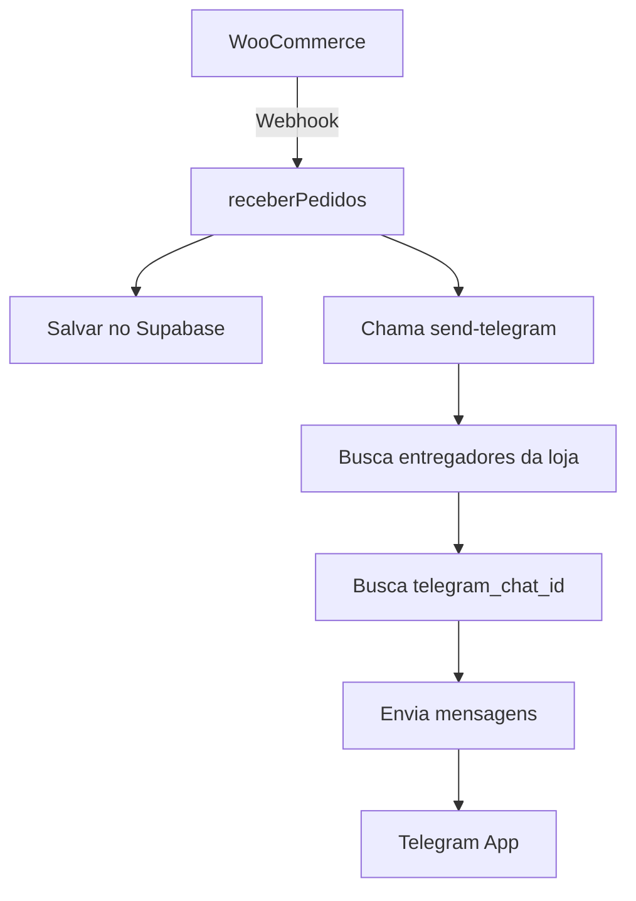

# 🚀 ARQUITETURA TELEGRAM NOTIFICATIONS

## 🚀 **RESPOSTA À SUA PERGUNTA:**

> "Preciso criar uma Edge Function ou é incorporada?"

**RESPOSTA:** Você precisa criar **DUAS Edge Functions** separadas:

1. **`receberPedidos`** → Recebe webhook + salva + chama Telegram
2. **`send-telegram`** → Recebe dados + envia via Telegram Bot API

## 📊 **ARQUITETURA COMPLETA:**



## 🔧 **CONFIGURAÇÃO NECESSÁRIA:**

### ⚙️ **Variáveis de Ambiente Supabase:**
```bash
TELEGRAM_BOT_TOKEN=123456789:ABCDEF1234567890abcdef1234567890
TELEGRAM_CHAT_IDS=123456789,987654321,555666777
```

### 📊 **Nova Coluna no Banco:**
```sql
-- Adicionar na tabela usuarios (ou loja_associada)
ALTER TABLE usuarios ADD COLUMN telegram_chat_id TEXT;
```

## 🔄 **FLUXO DETALHADO:**

### **1️⃣ receberPedidos (Modificada):**
```javascript
// Salva pedido no banco
const pedidoInserido = data[0];

// Chama função Telegram
await enviarNotificacaoTelegram(pedidoInserido);
```

### **2️⃣ send-telegram (Nova):**
```javascript
// Busca entregadores da loja
const entregadores = await supabase
  .from('loja_associada')
  .select('telegram_chat_id')
  .eq('id_loja', pedido.id_loja)

// Envia para todos os chat_ids
await fetch(`https://api.telegram.org/bot${token}/sendMessage`, {
  body: JSON.stringify({
    chat_id: chatId,
    text: mensagemFormatada
  })
});
```

## 🎯 **VANTAGENS DO TELEGRAM:**

### ✅ **VS FCM (Firebase):**
- 💰 **Zero custos** (Telegram é gratuito)
- 🛡️ **Mais confiável** (menos bloqueios)
- 📱 **Não depende do app** instalado
- 🎯 **Notificação instantânea**
- 📊 **Melhor taxa de entrega**

### 📟 **Vantagens das Edge Functions Separadas:**
- 🔧 **Modular:** Cada função tem uma responsabilidade
- 🧪 **Testável:** Pode testar Telegram independente
- 🔄 **Reutilizável:** Outras partes podem usar Telegram
- 🚀 **Escalável:** Telegram pode crescer independente

## 📱 **MENSAGEM TELEGRAM:**

```
🚚 Novo Pedido Disponível!

📦 Pedido: #L1-1001
🏪 Loja: Mercearia Luanda
👤 Cliente: João Silva
📞 Telefone: 2132757548
🚚 Endereço: Rua Casemiro de Abreu, 59
💰 Total: R$ 45.50
📦 Produtos: Alface (1), Alcatra (Kg) (1)

⏰ Aceite o pedido pelo app!
```

## 🔧 **IMPLEMENTAÇÃO:**

### **PASSO 1:** Criar Edge Function `send-telegram`
### **PASSO 2:** Modificar `receberPedidos` para chamar Telegram
### **PASSO 3:** Configurar variáveis de ambiente
### **PASSO 4:** Adicionar `telegram_chat_id` no banco
### **PASSO 5:** Testar com webhook real

**RESULTADO:** Sistema mais confiável e económico que FCM! 🚀

